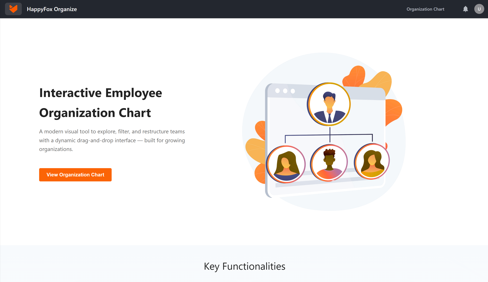

# Happy Organize  - HappyFox Frontend Assignment

**Happy Organize** is a modern, interactive tool for visualizing and managing employee hierarchies.  
It provides a real-time, drag-and-drop interface to restructure reporting lines, filter by team, and simulate organizational changes, all with a clean, responsive UI and mock backend integration.

🎯 Built as a frontend assignment for **HappyFox**.

---

## 🔗 Hosted Link

**Live Demo**: [happy-fox-assignment.vercel.app](https://happy-fox-assignment.vercel.app/)  
**Page Assigned**: [happy-fox-assignment.vercel.app/chart](https://happy-fox-assignment.vercel.app/chart)  
(Recommended: Desktop View for full chart experience)

---

## 📸 Screenshots

### ✅ Home Page - Project Overview & Features



### 🧩 Organization Chart Interaction


---

## ⚙️ Features

- 📋 **Employee List** – Fetches and displays employee details (name, designation, team).
- 🔍 **Search & Filter** – Filter employees by team or name in real-time.
- 📊 **Org Chart View** – Hierarchy chart rendered from manager relationships.
- 🔄 **Drag & Drop Updates** – Reassign employees live using React DnD.
- 🚫 **Validation Logic** – Prevents circular hierarchies, CEO misplacement, and duplicate updates.

---

## 🛠️ Tech Stack

| Area             | Technology Used                |
|------------------|--------------------------------|
| Frontend         | React.js                       |
| State/Events     | React Hooks                    |
| Chart Logic      | Custom Tree Renderer using managerId |
| Styling          | Vanilla CSS                    |

---
---

## ▶️ Running Instructions

1. **Clone the Repository**
   ```bash
   git clone https://github.com/your-username/happy-organize.git
   cd happy-organize
   ```

2. **Install Dependencies**
   ```bash
   npm install
   ```

3. **Start the Development Server**
   ```bash
   npm start
   ```

   The app will be available at `http://localhost:3000` or `http://localhost:5173`

---

